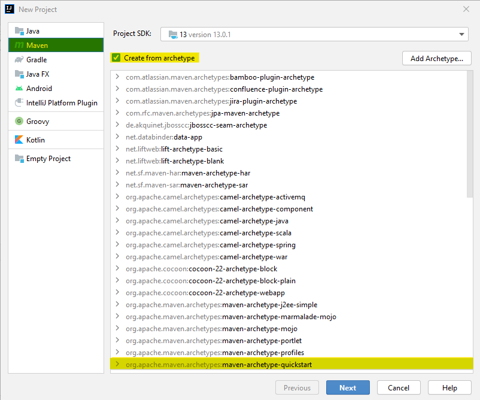

Creación del proyecto Maven
============================

Al haber elegido IntelliJ IDEA, habría que seguir unos pasos para crear correctamente el proyecto.

*¿Cómo crear un proyecto Maven en IntelliJ IDEA?*
-------------------------------------------------
#. Abrir el entorno y crear un nuevo proyecto.
#. Seleccionar *Create form archetype* y, luego, *org.apache.maven.archetypes:maven-archetype-quickstar*, como se indica en la imagen siguiente.

:width: 300
:align: center
